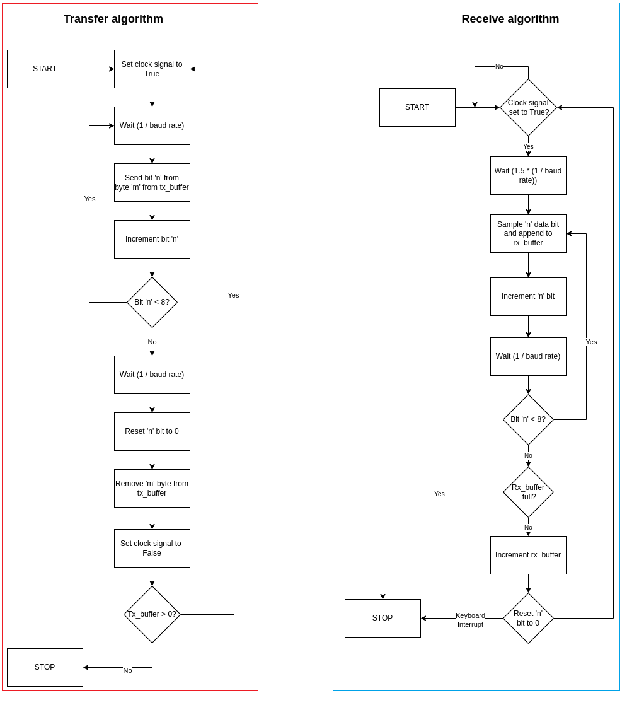

# How to use:

Equipment list: 

- Raspberry Model B+
- LED lamps
- DHT22 sensor 
- SHT21 sensor

All scripts are ran from the RPi terminal using:

```bash
sudo python3 skripta.py
```

 

### Modules:

Contains modules for the above mentioned sensors. Can be ran idependently or imported as libraries without running automatically.

#### Content:

1. Modules with _auto sufix give a set number or readings before shutting down.

2. Modules with _cons sufix have infinite (while True: ) loops, and have to  be closed with a KeyboardInterrupt() exception (CTRL+C).

3. rpi_i2c.py - a premade library used to run the SHT21 sensor via i2c communication.

**Note:**

In addition its neccessary to prepare several settings/modules on the RPi:

```bash
sudo apt-get update
sudo apt-get install git build-essential i2c-tools
```

After installing I2C tools, make sure to enable I2C via:

```bash
sudo raspi-config
```

In order to use the DHT sensor make sure to download the AdaFruit-DHT library on the RPi:

```bash
sudo pip3 install adafruit-circutpython-dht
```

Afterwards reboot the device.


### Examples:

Contains practical examples which use imported libraries from the Modules folder.


#### Content:

1. combined_sensors.py - makes use of all currently available sensors, for a sequential run and data collection.

5. spojeno.py - svi moduli zajedno unutar jedne skripte, samostalno i sekvencijalno pokreće rad spojenih senzora. Potrebno je upisati broj pina na koji je senzor spojen!


**Note:**

When asked to input pins to whom the sensors are connected makes sure to follow the GPIO.BCM logic, if another logic is used on the pinout connection diagram change the code accordingly. There could be a difference regarding GPIO.BCM pins from model to model, check the following [link](https://www.raspberrypi-spy.co.uk/2012/09/checking-your-raspberry-pi-board-version/) for more information.

Whilst importing modules the following was used:

```python
import sys
sys.path.append("home/pi/Modules")
```

Pay attention to where you save the modules, since the /path may vary.

Another possible solution was to use:

```python
sys.path.insert(1, "home/pi/Modules")
```

### Applications:

Contrains a server/slave architecture based network application which established communication either via TPC/IP protocol or UDP/IP protocol.  The server is a daemon application which waits for the client application input before replying, one of the capabilities is sending temperature and humidity readings from a DHT21 sensor.

The scripts have 3 obligatory arguments - IP of the host, Port, DHT pin;  and 2 exclusive arguments: TCP or UDP protocol. Run the scripts with:

```bash
sudo python3 server.py "host IP" "port" "dht pin" "tcp or udp"
```

### Serial Protocol:

Enables serial data transfer between 2 Raspberry Pi's (Model B+ was used for both devices), over GPIO pins without integrated hardware support. For a full duplex communication 4 physical wired are needed: Tx, Rx, Clock and Ground.

The algorithm is shown below and utilizes a mutual 'Clock' connection which is used to synchronize baud rates on the transfering and receiving sides .



